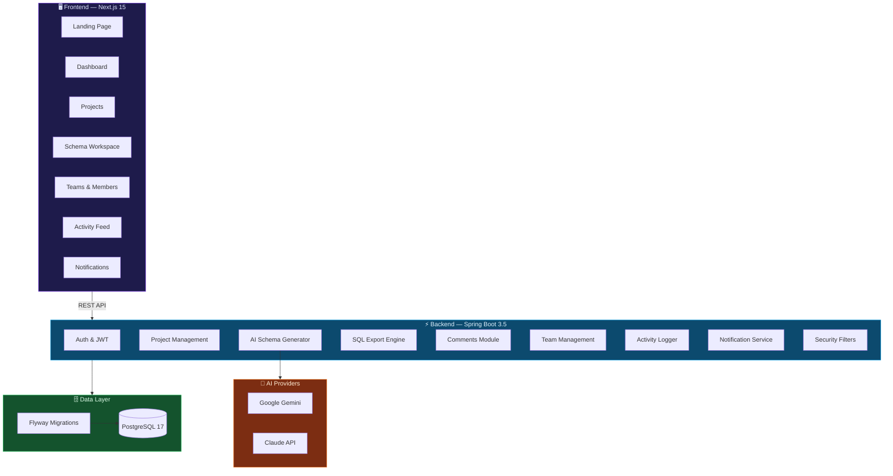

<div align="center">

<!-- Animated gradient banner using SVG -->


<br/>

<p>
  <a href="#-quick-start"></a>
  <a href="http://localhost:8080/swagger-ui/index.html"></a>
  <a href="#-architecture"></a>
</p>

<p>
  
  
  
  
  
  
  
</p>

<br/>

> **Describe your database in plain English. Get production-ready SQL in seconds.**
>
> SchemaForge AI is a full-stack platform that uses AI to convert natural language requirements into normalized, version-controlled relational database schemas — with team collaboration, multi-dialect SQL export, and an immutable audit trail built in.

<br/>

</div>

---

## ✨ Why SchemaForge AI?

<table>
<tr>
<td width="50%">

### 🧠 AI-Powered Schema Generation
Describe what your app does in plain English. SchemaForge uses **Google Gemini** and **Claude** to generate fully normalized database schemas with tables, columns, relationships, indexes, and constraints — no manual ERD clicking required.

</td>
<td width="50%">

### 🔄 Multi-Dialect SQL Export
Export production-ready DDL for **PostgreSQL**, **MySQL**, **Oracle**, and **SQL Server** with a single click. Every export is tracked, versioned, and downloadable.

</td>
</tr>
<tr>
<td width="50%">

### 👥 Team Collaboration
Create workspaces, invite members with role-based access (**Owner → Admin → Member → Viewer**), leave threaded comments on schemas, and get real-time notifications.

</td>
<td width="50%">

### 📜 Activity Feed & Audit Trail
Every action — schema generation, export, team change, comment — is logged as an immutable activity record. Filter by type, paginate, and inspect full metadata per event.

</td>
</tr>
</table>

---

## 🏗 Architecture



---

## 🎯 Feature Matrix

| Module | Description | Backend | Frontend |
|--------|-------------|:-------:|:--------:|
| **Authentication** | JWT + refresh tokens, BCrypt, role-based access | ✅ | ✅ |
| **Projects** | CRUD, archiving, ownership, dialect selection | ✅ | ✅ |
| **AI Generation** | NL → normalized schema via Gemini / Claude | ✅ | ✅ |
| **Schema Management** | Multi-version, metadata, restore, soft-delete | ✅ | ✅ |
| **SQL Export** | PostgreSQL, MySQL, Oracle, SQL Server DDL | ✅ | ✅ |
| **Comments** | Threaded discussions, entity refs, edit tracking | ✅ | ✅ |
| **Teams** | Workspaces, invitations, RBAC (4 roles) | ✅ | ✅ |
| **Notifications** | Auto-generated alerts, mark read, bulk ops | ✅ | ✅ |
| **Activity Feed** | Immutable audit trail, filters, paginated | ✅ | ✅ |
| **Dashboard** | Stats overview, recent projects, AI credits | ✅ | ✅ |

---

## 🚀 Quick Start

### Prerequisites

- **Java 21+** · **Maven** · **Node.js 18+** · **PostgreSQL 16+**
- An API key for [Google Gemini](https://ai.google.dev/) or [Anthropic Claude](https://console.anthropic.com/)

### Option 1 — Docker (Recommended)

```bash
# Clone the repository
git clone https://github.com/Jawahar08/schemaforge-Ai.git
cd schemaforge-Ai

# Set your AI provider key
export ANTHROPIC_API_KEY=sk-ant-...
export NEXT_PUBLIC_ANTHROPIC_API_KEY=sk-ant-...

# Launch everything
docker compose up -d
```

| Service | URL |
|---------|-----|
| 🖥️ Frontend | [http://localhost:3000](http://localhost:3000) |
| ⚡ Backend API | [http://localhost:8080](http://localhost:8080) |
| 📖 Swagger UI | [http://localhost:8080/swagger-ui/index.html](http://localhost:8080/swagger-ui/index.html) |

### Option 2 — Manual Setup

<details>
<summary><b>Backend</b></summary>

```bash
cd backend

# Configure your database and AI keys in application.yml
# (or use environment variables)

# Build & run
mvn clean compile
mvn spring-boot:run
```

The API will be live at `http://localhost:8080`.

</details>

<details>
<summary><b>Frontend</b></summary>

```bash
cd frontend

# Install dependencies
npm install

# Create .env.local from .env.example
cp .env.example .env.local

# Start dev server
npm run dev
```

The app will be live at `http://localhost:3000`.

</details>

---

## 📁 Project Structure

```
schemaforge-Ai/
│
├── backend/                          # Spring Boot 3.5 API
│   └── src/main/java/com/schemaforge/
│       ├── ai/                       # AI client, prompt engineering, generation service
│       ├── auth/                     # JWT authentication, login, register
│       ├── project/                  # Project CRUD, archival, ownership
│       ├── schema/                   # Schema entity, versioning, restore
│       ├── export/                   # Multi-dialect SQL generation & download
│       ├── comment/                  # Threaded comments, entity references
│       ├── team/                     # Workspaces, members, invitations, RBAC
│       ├── notification/             # Auto-generated alerts, read tracking
│       ├── activity/                 # Immutable audit log, filters, pagination
│       ├── dashboard/                # Dashboard aggregation endpoints
│       ├── security/                 # Spring Security config, JWT filter chain
│       ├── config/                   # App-wide configuration beans
│       ├── common/                   # Shared entities, DTOs, exceptions
│       └── user/                     # User entity, profile endpoints
│
├── frontend/                         # Next.js 15 + TypeScript
│   └── src/
│       ├── app/                      # File-based routing (App Router)
│       │   ├── activities/           # Global audit trail feed
│       │   ├── dashboard/            # Stats, recent projects, AI credits
│       │   ├── projects/[id]/        # Project detail + tabbed activity log
│       │   ├── schemas/[id]/         # Schema workspace (tables, ER diagram)
│       │   ├── teams/[id]/           # Team members, invites, team activity
│       │   ├── notifications/        # Alert center
│       │   └── settings/             # User profile & plan info
│       ├── components/               # Reusable UI: landing, layout, schema, auth
│       ├── lib/                      # API client, utilities, api-modules
│       ├── store/                    # Zustand auth store
│       └── types/                    # Shared TypeScript interfaces
│
├── docker-compose.yml                # Full-stack orchestration
└── docs/                             # Architecture & DB design docs
```

---

## 🛡️ Security

| Layer | Implementation |
|-------|----------------|
| **Password Storage** | BCrypt adaptive hashing |
| **Authentication** | JWT access tokens + refresh token rotation |
| **Authorization** | Spring Security filter chain + `@PreAuthorize` |
| **Data Isolation** | Owner validation on every entity operation |
| **Team Access** | Role-based permission checks (OWNER → VIEWER) |
| **Input Validation** | Jakarta Bean Validation + global exception handler |
| **Database** | UUID primary keys, parameterized queries, Flyway migrations |

---

## 🛠 Tech Stack

<table>
<tr>
<td valign="top">

#### Backend
- Java 21
- Spring Boot 3.5
- Spring Security
- Spring Data JPA / Hibernate
- Flyway Migrations
- MapStruct · Lombok
- SpringDoc OpenAPI 3

</td>
<td valign="top">

#### Frontend
- Next.js 15 (App Router)
- TypeScript 5
- TailwindCSS 3
- TanStack React Query
- Zustand
- Framer Motion
- Lucide Icons

</td>
<td valign="top">

#### Infrastructure
- PostgreSQL 17
- Docker & Docker Compose
- Maven
- Swagger UI

#### AI Providers
- Google Gemini API
- Anthropic Claude API

</td>
</tr>
</table>

---

## 📡 API Overview

> Full interactive docs available at [`/swagger-ui`](http://localhost:8080/swagger-ui/index.html) when running locally.

| Endpoint Group | Base Path | Description |
|---------------|-----------|-------------|
| Auth | `/api/auth/*` | Login, register, token refresh |
| Users | `/api/users/*` | Profile management |
| Projects | `/api/projects/*` | CRUD, archive, ownership |
| Schemas | `/api/schemas/*` | Versions, restore, AI generation |
| Exports | `/api/exports/*` | Multi-dialect DDL generation |
| Comments | `/api/schemas/{id}/comments` | Threaded schema discussions |
| Teams | `/api/teams/*` | Workspaces, members, invitations |
| Notifications | `/api/notifications/*` | Alerts, read tracking |
| Activities | `/api/activities/*` | Audit trail, project & team feeds |

---

## 🗺 Roadmap

- [x] JWT Authentication & Authorization
- [x] Project Management (CRUD + Archive)
- [x] AI Schema Generation (Gemini + Claude)
- [x] Multi-Version Schema Management
- [x] Multi-Dialect SQL Export Engine
- [x] Threaded Comments & Discussions
- [x] Team Workspaces & RBAC Invitations
- [x] Notification System
- [x] Activity Feed & Audit Trail
- [x] Full-Stack Frontend (Next.js 15)
- [ ] WebSocket Real-Time Collaboration
- [ ] Schema Diff Viewer
- [ ] Database Reverse Engineering
- [ ] API Key Management
- [ ] Usage Analytics Dashboard
- [ ] Billing & Subscription Plans

---

## 🧑‍💻 Author

<p>
  <b>Jawahar Bharathi</b> — Full-Stack Developer
</p>
<p>
  <a href="https://github.com/Jawahar08"></a>
</p>

---

## 📄 License

This project is licensed under the **MIT License** — see the [LICENSE](LICENSE) file for details.

---

<div align="center">


<p>
  <sub>Built with ☕ Java, ⚡ Spring Boot, ⚛️ Next.js, and 🤖 AI</sub>
</p>

</div>